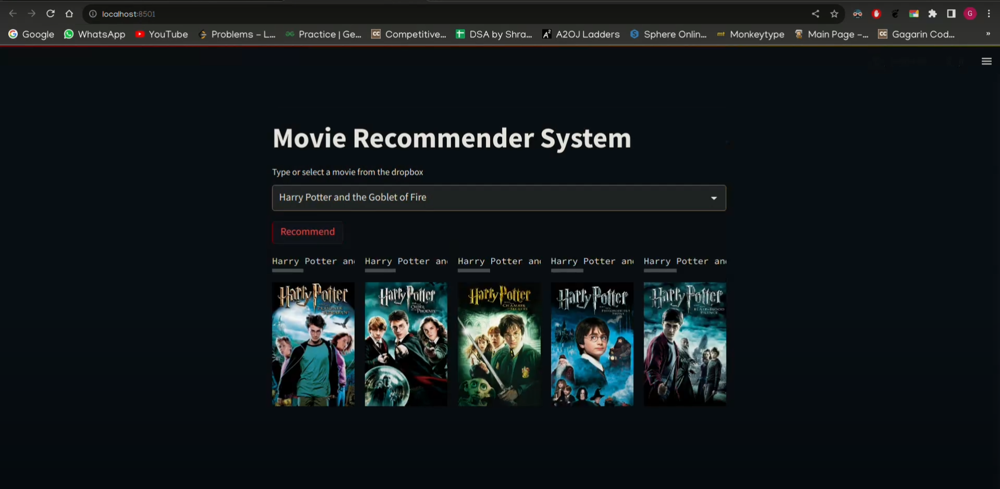

# Movie Recommender System

Movie Recommender System is an end-to-end movie recommending website developed using Streamlit, integrating a machine learning model into it. The website provides recommendations for similar movies from a collection of 4806 movies based on the user's selection.

## Features

1. **Streamlit Web Application**
   - Utilizes Streamlit to create an interactive and user-friendly web interface.

2. **Machine Learning Model**
   - Integrates a machine learning model for movie recommendations.
   - Leverages textual data such as movie genre, overview, keywords, top 3 cast, and director for making personalized recommendations.

3. **Natural Language Processing (NLP)**
   - Utilizes NLTK for natural language processing to preprocess textual data.

4. **Scikit-learn Integration**
   - Converts tags into vector format using Scikit-learn for further computation and analysis.

## How it Works

The recommender system employs a machine learning model that considers various features such as movie genre, overview, keywords, top 3 cast, and director. Natural Language Processing (NLP) techniques are applied using NLTK for preprocessing the textual data. The tags are then converted into vector format using Scikit-learn, enabling the model to make accurate and relevant movie recommendations based on user preferences.

## Screenshot




## How to Run

1. Clone the repository.
   ```bash
   git clone https://github.com/gagarinrout/movie-recommender-system.git

2. Install the required dependencies.
   ```bash
   pip install -r requirements.txt

3. Run the Streamlit app.
   ```bash
   streamlit run app.py

4. Open the provided URL in a web browser.


